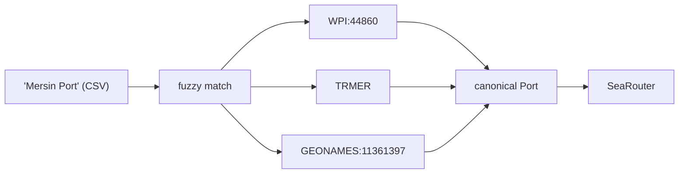

# harborly

[](https://github.com/frogiraffe/harborly/actions/workflows/ci.yml)
[](https://pypi.org/project/harborly/)
[](https://pypi.org/project/harborly/)
[](https://github.com/frogiraffe/harborly/blob/main/LICENSE)


**Port identity resolution, spatial search, and analytical sea routing.**

`harborly` is a typed Python SDK and CLI. It resolves port identities, finds nearby ports, reviews ambiguous CSV matches, and calculates approximate sea-route distances in nautical miles.

> [!IMPORTANT]
> Routes are analytical approximations on a maritime graph. They are not for navigation, voyage planning, or safety-critical use.

## Why Harborly?

Port databases represent the same physical port with different identifiers, names, and coordinates. A single port can appear as WPI:44860 in one system, LOCODE `TRMER` in another, and `GEONAMES:11361397` in a third. An external CSV may call it "Mersin Port" while the registry says "Mersin". Coordinates can drift between datasets.

Harborly solves this with source-aware entity resolution. Each registry record carries its provenance.



Exact, prefix, and fuzzy search resolve identities across naming conventions. When automatic matching is ambiguous, human-review decision files control the outcome.

After resolution, Harborly calculates approximate sea-route distances on a maritime graph. It returns great-circle baselines, detour ratios, and quality flags. The package supports distance matrices, spatial nearest-neighbor search, and GIS export.

## Features

### Resolve & Match

- Resolves registry IDs, UN/LOCODEs, and exact aliases.
- Searches port names with exact, prefix, fuzzy, country, and proximity filters.
- Matches CSV rows with human-review decision files.

### Route & Analyze

- Calculates sea routes and process-parallel distance matrices.
- Streams large distance matrices without memory growth.
- Computes multi-leg routes over a list of ports using `route_sequence()`.
- Calculates vessel speed and ETA directly on routes (`speed_knots`, `duration_hours`, `duration_days`).
- Restricts passages like Suez, Panama, Kiel, Baban, and Northwest via `PassageRestriction`.
- Provides `AsyncSeaRouter` for async/await interface to `route()` and `route_sequence()`.

### Export & Integrate

- Serves port routing over a local FastAPI HTTP server.
- Visualizes ports and routes in a terminal UI or standalone HTML maps.
- Exports route data to KML format (`--kml`, `--format kml`).
- Exports route data to GeoParquet format (`--format geoparquet`).

### Performance

Registry of ~20,000 ports loads in 0.117 seconds.

| Workload | Cold (ms) | Warm — cached (ms) |
| --- | --- | --- |
| Exact match | 9.3 | 0.004 |
| Fuzzy/typo | 13.0 | 0.007 |
| Country-only | 9.2 | 0.004 |

Median of 300 rows per bucket. Cold: first pass. Warm: LRU-cached repeat.
Python 3.14, Linux, 12-core CPU. Reproduce: `uv run python -m benchmarks.matching_performance`.

## Installation

Install the core CLI with routing:

```bash
uv tool install 'harborly[routing]'
```

Install with all optional extras (`routing`, `api`, `map`, `tui`, `fast`, `analysis`):

```bash
uv tool install --force 'harborly[routing,api,map,tui,fast,analysis]'
```

For local development:

```bash
uv sync --dev --all-extras
uv run harborly info
```

## Quick start

```bash
harborly search Mersin --country TR
harborly show TRMER
harborly near 39.87 26.16 --country TR --limit 5
harborly route TRMER GRPIR --geojson route.geojson --html-map route.html
```

Example output:

```text
origin: Mersin (WPI:44860)
destination: Piraievs (WPI:42230)
distance_nmi: 594.46
great_circle_nmi: 528.19
detour_ratio: 1.125
quality_flag: ok
engine: searoute 1.6.0 (astar, networkx)
```

## Python SDK

```python
from harborly import PortRegistry, SeaRouter

registry = PortRegistry.bundled()
origin = registry.resolve("TRMER")
destination = registry.resolve("GRPIR")

router = SeaRouter(cache_path=".cache/harborly/routes.sqlite3")
route = router.route(origin, destination)
matrix = router.distance_matrix([origin, destination], max_workers=4)

print(f"Distance: {route.distance_nmi} nmi, status: {route.quality_flag}")
```

```python
import asyncio
from harborly import AsyncSeaRouter, PassageRestriction, PortRegistry

async def async_example():
    registry = PortRegistry.bundled()
    mersin    = registry.resolve("TRMER")
    singapore = registry.resolve("SGSIN")
    jebel_ali = registry.resolve("AEJEA")

    # Restrictions are set on the router; route_sequence takes the port list
    router = AsyncSeaRouter(restrictions=[PassageRestriction.SUEZ])
    seq = await router.route_sequence([mersin, jebel_ali, singapore], speed_knots=15.0)
    print(f"Sequence distance: {seq.total_distance_nmi:.0f} nmi")
    print(f"Duration: {seq.duration_days:.1f} days ({seq.duration_hours:.0f} hours)")
    for i, leg in enumerate(seq.legs, 1):
        print(f"  Leg {i}: {leg.origin.name} → {leg.destination.name}: {leg.distance_nmi:.0f} nmi")

asyncio.run(async_example())
```

## CLI Reference

| Command | Operation |
| --- | --- |
| `info` | Inspect active registry statistics |
| `search` | Search ports by name, country, or code |
| `show` | Resolve a single port identity |
| `near` | Find ports near coordinates |
| `route` | Calculate a sea route between two ports |
| `matrix` | Calculate a parallel distance matrix |
| `cache` | Inspect, prune, or clear SQLite route cache |
| `match` | Match CSV rows and generate review files |
| `export` | Export port data as CSV, GeoJSON, KML, or GeoParquet |
| `tui` | Launch terminal map interface |
| `serve` | Run FastAPI HTTP service |
| `data prepare` | Download and build local reference data |

### Exit codes

| Exit code | Meaning |
| --- | --- |
| `0` | Success |
| `1` | Data verification failed |
| `2` | Validation, resolution, or routing error |
| `130` | Interrupted (`Ctrl-C`) |

## HTTP Service

Run the local API server:

```bash
harborly serve --host 127.0.0.1 --port 8000
```

- `GET /v1/livez` — liveness probe.
- `GET /v1/readyz` — readiness probe.
- `GET /v1/route?origin=TRMER&destination=GRPIR` — calculate route.

## Documentation Index

- [Getting Started](https://github.com/frogiraffe/harborly/blob/main/docs/GETTING-STARTED.md)
- [Reference](https://github.com/frogiraffe/harborly/blob/main/docs/REFERENCE.md) — library, CLI, HTTP, schemas, routing, data, exports, and TUI.
- [Configuration](https://github.com/frogiraffe/harborly/blob/main/docs/CONFIGURATION.md)
- [Architecture](https://github.com/frogiraffe/harborly/blob/main/docs/ARCHITECTURE.md)
- [Development](https://github.com/frogiraffe/harborly/blob/main/docs/DEVELOPMENT.md)
- [Testing](https://github.com/frogiraffe/harborly/blob/main/docs/TESTING.md)
- [Contributing](https://github.com/frogiraffe/harborly/blob/main/CONTRIBUTING.md) — conduct, security reporting, and compatibility policy.

## License

MIT License. See [LICENSE](https://github.com/frogiraffe/harborly/blob/main/LICENSE) for details.
