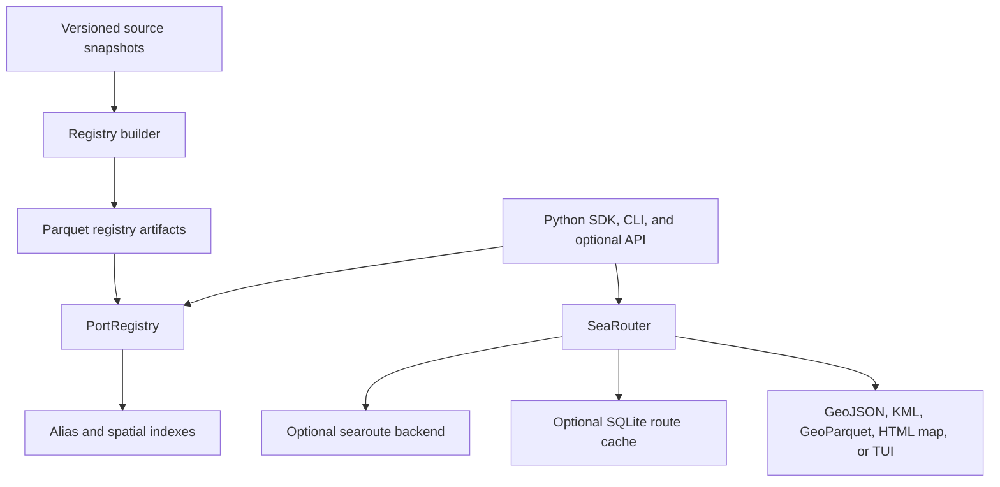

# Architecture

`harborly` is a layered Python package for resolving source-aware port identities and calculating approximate sea-route distances. Its public SDK, CLI, and optional FastAPI service load the same bundled or local Parquet registry, use shared search and spatial indexes to select `Port` records, then pass validated coordinates to the routing layer; results can be cached and exported as structured, map, or terminal output.

## Component diagram



## Data flow

1. A caller uses the Python SDK, the `harborly` CLI, or the optional FastAPI application exposed by the `harborly.api` module.
2. `PortRegistry.bundled()` loads the packaged Parquet registry and aliases, validates their schema, and builds ID, UN/LOCODE, and alias lookup structures. Its spatial index is constructed only when a nearest-port query needs it.
3. `PortRegistry.resolve()`, `search()`, or `nearest()` returns source-provenanced `Port` records or grouped identities. Alias search prefers exact and prefix matches before fuzzy candidates; nearest search ranks records by great-circle distance.
4. `SeaRouter.route()` validates origin and destination coordinates, calculates the great-circle baseline, retrieves a matching persistent cache entry when configured, or calls the routing backend with the effective algorithm, graph backend, and passage restrictions.
5. The router validates returned geometry and route plausibility, persists valid raw backend results to SQLite when configured, and returns a `SeaRoute`. The CLI, API, and export helpers serialize that result for their respective interfaces.

## Key abstractions

| Abstraction | Responsibility | Location |
| --- | --- | --- |
| `Port` | Immutable provider-specific port record with source provenance and optional coordinates. | `src/harborly/_registry_data.py` |
| `PortRegistry` | Public facade for loading, resolving, searching, grouping, and matching port records. | `src/harborly/ports.py` |
| `AliasSearchIndex` | Produces exact, prefix, and fuzzy alias candidates for registry search. | `src/harborly/search.py` |
| `PortSpatialIndex` | Selects nearby coordinate-bearing records, using SciPy `cKDTree` when the optional `fast` extra is installed. | `src/harborly/spatial.py` |
| `SeaRouter` / `AsyncSeaRouter` | Calculates individual, sequential, and matrix routes; the async wrapper delegates blocking work to threads. | `src/harborly/router.py` |
| `SeaRoute` / `SequenceSeaRoute` | Immutable route results with provenance, quality data, geometry, and export helpers. | `src/harborly/router.py` |
| `_RoutingBackend` / `SeaRouteBackend` | Narrow internal backend contract and its lazily imported `searoute` adapter. | `src/harborly/_routing_backend.py` |
| `RouteCache` | Direction-sensitive SQLite persistence for raw routing-backend results. | `src/harborly/route_cache.py` |
| `build_reference_registry()` | Normalizes downloaded source data into packaged registry artifacts and a manifest. | `src/harborly/build/registry.py` |

## Directory structure

```text
src/harborly/
├── __init__.py              # Stable public Python exports
├── cli.py                   # Command-line interface and output handling
├── ports.py                 # Public registry facade
├── _registry_*.py           # Registry loading, validation, search, and services
├── search.py / spatial.py   # Alias and nearest-port indexing
├── router.py / routing.py   # Route orchestration and routing policies
├── _routing_backend.py      # Internal backend protocol and searoute adapter
├── route_cache.py           # SQLite route cache
├── api.py                   # Optional FastAPI application
├── build/                   # Source download and normalized artifact generation
├── sources/                 # Parsers for supported public source formats
├── tui/                     # Optional Textual terminal map interface
└── data/                    # Distributed Parquet registry, manifest, and attribution
tests/                       # Unit, integration, contract, and regression coverage
benchmarks/                  # Matching and route-accuracy benchmark tooling
docs/                        # User, API, operations, and maintainer documentation
```

The top-level `harborly` package is the stable public surface, with underscore-prefixed modules separating implementation details from public facades. Optional capabilities stay at module boundaries: routing needs the `routing` extra, while API, maps, TUI, accelerated spatial lookup, and analysis have separate extras. The builder and source parsers are kept outside runtime registry lookup so distributed artifacts can be loaded without fetching external data.

For public interfaces and route-cache behavior, see the [Reference](REFERENCE.md).
