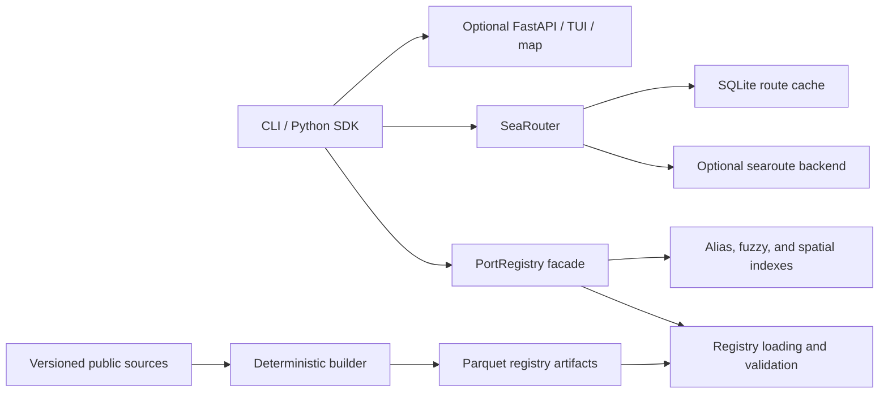

# Architecture

`sea-mile` keeps a small public facade while separating registry loading,
identity resolution, spatial search, routing, persistence, and presentation.
Names exported through `sea_mile.__all__` are the supported Python surface;
underscore-prefixed modules are implementation details.

## Registry facade

`PortRegistry` remains the public facade in `ports.py`. Internal loading,
search, grouping, validation, and resolution services live in
`_registry_data.py`, `_registry_search.py`, `_registry_validation.py`, and
`_registry_services.py`. Alias and coordinate indexes are isolated in
`search.py` and `spatial.py`.

External DataFrames are copied at the boundary. The registry validates required
columns, unique provider-qualified IDs, alias references, coordinate ranges,
and the optional artifact schema version before building indexes.

## Coordinate boundaries

Coordinate order is represented explicitly:

- `LatLon(latitude, longitude)` is the SDK and internal contract.
- `LonLat(longitude, latitude)` is the X/Y contract used by GeoJSON and the
  routing backend.
- The optional SciPy spatial index stores Earth-centered Cartesian XYZ derived
  from validated WGS84 coordinates, avoiding longitude discontinuities at the
  antimeridian.

Latitude is constrained to `[-90, 90]` and longitude to `[-180, 180]`.
Source parsers reject invalid degree-minute-second components. Returned routes
are checked against their great-circle lower bound.

## Routing and concurrency

The routing backend is optional and loaded lazily. The bundled searoute backend
declares symmetric output, so an `n`-port matrix calculates `n(n-1)/2` edges.
Directional internal backends calculate both directions.

Matrix pairs are generated lazily and submitted to a spawn-based
`ProcessPoolExecutor` in bounded batches. The automatic worker count is capped
at four. A dense matrix necessarily retains O(n²) floats;
`SeaRouter.iter_distance_edges` and `matrix --edge-csv` provide bounded-memory
streaming alternatives.

See [Routing and cache operations](../ROUTING_AND_CACHE.md) for failure,
retry, cache, and maintenance semantics.

## Artifact pipeline

Source archives are downloaded as versioned snapshots rather than embedded in
Python modules. The builder normalizes provider records, writes Parquet
artifacts, and records row counts, source versions, checksums, and a
deterministic content hash.

The scheduled refresh workflow opens a pull request when normalized content
changes. CI verifies that the wheel contains the registry, attribution, and
manifest files. Local reference builds and the compact bundled wheel artifact
are deliberately distinguished in validation output.

## Data contracts

Pandera schemas validate generated review rows, human decisions, and matrix
edges. Identifiers are read as strings without coercion. The contracts reject
extra columns, duplicate or missing IDs, non-finite distances, and invalid
coordinate ranges.

CLI JSON uses an independently versioned schema. Registry artifacts use
`registry_schema_version`; cache tables use SQLite `user_version`; cache keys
carry a separate format version.

## Optional boundaries

Routing, API, map, TUI, spatial acceleration, and analytical validation are
separate extras. Core registry imports do not require those integrations.
Optional CLI commands check their complete extra set before starting and return
actionable installation instructions when a capability is absent.
